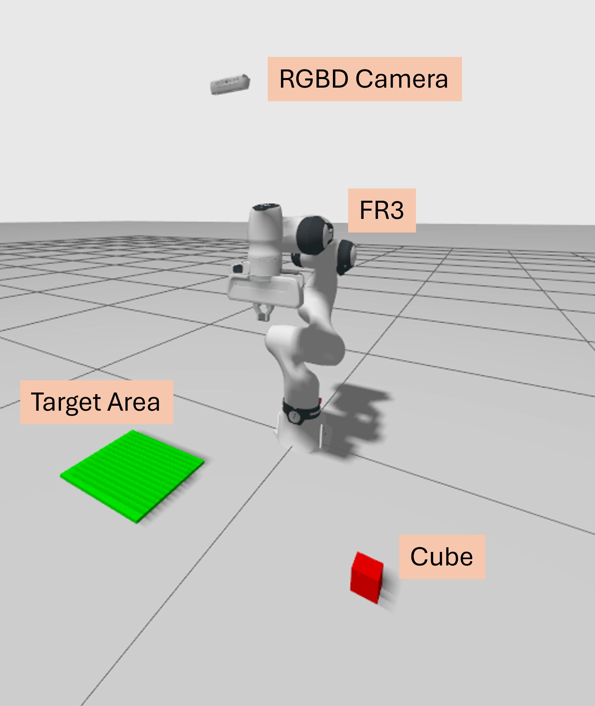
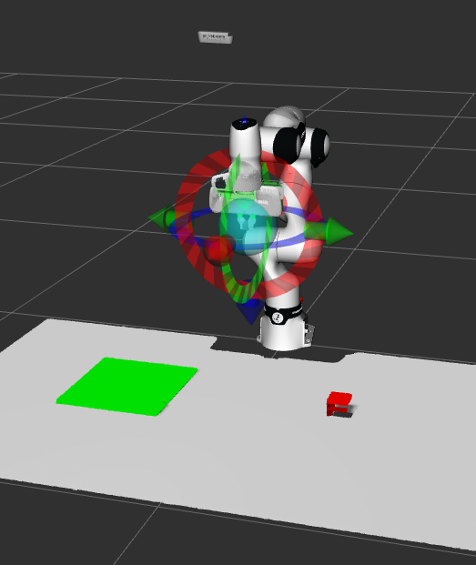
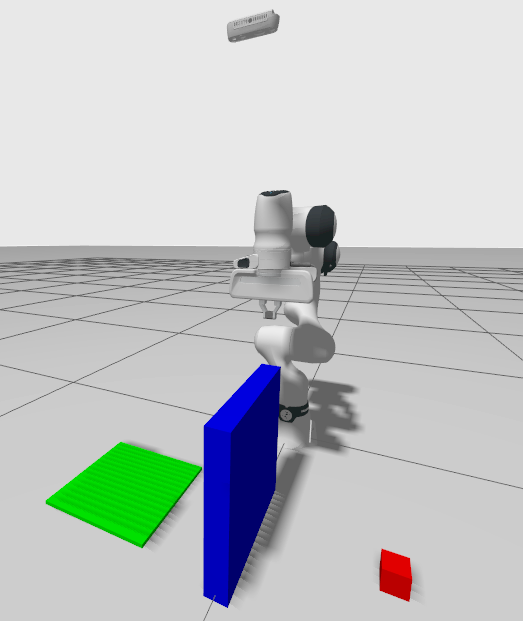

# Industrial Robotics Course Project

This repository contains the project for the Industrial Robotics course. The system is built around the [Franka ROS 2 environment](https://github.com/frankarobotics/franka_ros2) and is focused on a pick-and-place task in simulation.

## Installation

Update:
  ```bash
  sudo apt update
  ```

Install the **Development Tools** package:
  ```bash
  sudo apt install ros-dev-tools
  ```
**Clone the Repositories:**
   ```bash
   git clone https://github.com/BernardoBrogi/ROS2_project_franka.git
   ```
**Detect and install project dependencies**
   ```bash
   rosdep install --from-paths src --ignore-src --rosdistro humble -y
   ```
**Build**
   ```bash
   # use the --symlinks option to reduce disk usage, and facilitate development.
   colcon build --symlink-install --cmake-args -DCMAKE_BUILD_TYPE=Release
  ```
**Adjust Enviroment**
   ```bash
   # Adjust environment to recognize packages and dependencies in your newly built ROS 2 workspace.
   source install/setup.sh
  ```


## Project Goal

The objective is to pick up a cube in simulation and place it autonomously inside a container using:

- Gazebo Ignition for the simulated environment
- MoveIt for motion planning and execution
- A simulated Intel RealSense RGB-D camera for perception

The robot must be able to detect the object, plan a grasp, pick the cube, and place it into the container without manual intervention.

## Simulation Setup

The simulated world includes:

- A Franka FR3 robotic arm
- A cube to be picked
- A container where the cube must be placed
- An optional static obstacle positioned between the robot and the cube (for the obstacle-avoidance extension)
- A simulated Intel RealSense RGB-D camera

The camera streams both RGB data and point cloud information. These data streams can be visualized through ROS 2 topics and in RViz.

## Assignment Requirements

Students are expected to implement the following components:

1. A node that reads the camera data and estimates the pose of the cube.
2. A grasping and manipulation pipeline that uses the estimated pose to pick the cube.
3. Optional extension: motion planning that avoids collisions with an obstacle placed between the robot and the cube.
4. A placement policy that autonomously places the cube inside the container.
5. A Gazebo world containing the cube and the container (and optionally the obstacle, if implementing obstacle avoidance).
6. A launch process where the cube spawns in a random reachable pose every time the simulation is started.

The random spawn pose must always remain reachable for the robot so the manipulation task can be completed reliably.

## Optional Obstacle Avoidance

Obstacle avoidance is optional for this project and is not a required/recommended baseline milestone.

If you still want to implement it as an additional feature, two possible approaches are:

- Use the MoveIt perception pipeline with OctoMap to build a 3D occupancy map from camera data and feed it to the planner for collision-aware trajectory generation.
- Use a simpler hard-coded collision object in the MoveIt planning scene, following the planning-around-objects tutorial.

Reference tutorial:

- https://moveit.picknik.ai/main/doc/examples/perception_pipeline/perception_pipeline_tutorial.html
- https://moveit.picknik.ai/main/doc/tutorials/planning_around_objects/planning_around_objects.html

## Data and Visualization

The camera provides:

- RGB images
- Point clouds

These outputs are intended to support object recognition, pose estimation, and debugging. RViz can be used to inspect the camera feeds, point cloud data, and the robot scene.

## Simulation Run Examples

Use this section to document example commands for starting the simulation, launching the robot stack, and opening RViz.

### Start the full simulation

```bash
ros2 launch franka_gazebo_bringup moveit_gazebo_franka_arm_example_controller.launch.py
```

## Environment Setup Examples

### Without Obstacle

Gazebo scene:


RViz scene:



### With Obstacle

Gazebo scene with obstacle:



## Perception Topics

### Camera Topics

- Depth image topic: `/fr3/depth_camera/points`
- Point cloud topic: `/fr3/depth_camera/points`

### Suggested RViz Displays

- Camera image
- Point cloud
- Robot model
- TF frames


